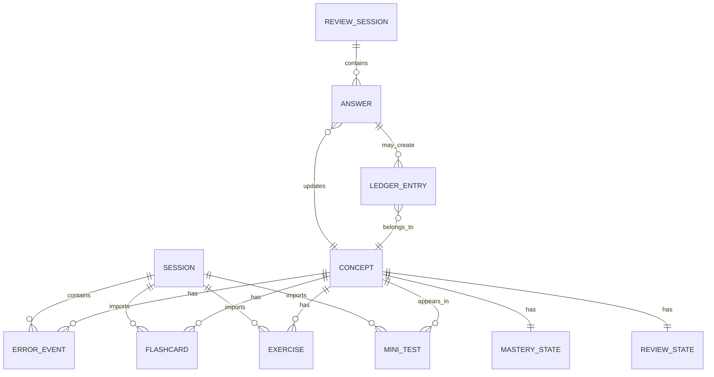

# Data Model - ZhongwenLock

## Purpose

This document describes the first conceptual data model for ZhongwenLock.

The goal is to define what kind of information the app needs to store and use before deciding the final DynamoDB table structure.

This model is still a draft. It will evolve as the MVP is implemented.

---

## Main Idea

ZhongwenLock is not mainly organized around study sessions.

The main learning unit is the concept.

A concept can be:

- a word;
- a verb;
- a noun;
- a grammar point;
- a particle;
- a sentence pattern;
- a pronunciation issue;
- a tone problem.

The app should help the user understand:

- which concepts are weak;
- which concepts are repeated often;
- which concepts are expensive in the simulated ledger;
- which concepts need review.

---

## External Event vs Internal State

The structured study session output generated by ChatGPT is an external study session event.

It contains what ChatGPT observed during a session:

- detected errors;
- affected concepts;
- suggested categories;
- suggested review priority;
- explanations;
- generated flashcards;
- generated exercises;
- generated mini-tests.

However, ChatGPT should not be the source of truth for long-term learning state.

ZhongwenLock calculates and stores:

- mastery scores;
- accumulated progress;
- simulated penalty amounts;
- ledger totals;
- review state;
- dashboard metrics.

This separation is important because ChatGPT observes one session, while ZhongwenLock owns the long-term learning history.

---

## Import Source

Study sessions may enter ZhongwenLock through different paths.

Possible import sources:

```text
manual_validation
custom_gpt_assisted
custom_gpt_direct
```

The import source exists for traceability.

Manual validation is an engineering step used before automating the target MVP import flow.

Regardless of import source, ZhongwenLock validates the received data and transforms it into internal learning items.

---

## Core Entities

### Session

Represents an imported study session from ChatGPT.

A session is useful for traceability, but it is not the main browsing experience of the app.

The user does not need to browse every old session in detail.

A session should include:

- session ID;
- user ID;
- HSK level;
- start time;
- finish time;
- score summary;
- import source;
- schema version.

---

### Concept

Represents a learning item.

This is the central entity of the app.

A concept can accumulate:

- historical errors;
- corrections;
- flashcards;
- exercises;
- mini-tests;
- mastery score;
- review state;
- simulated cost.

Concepts should be browsable by:

- HSK level;
- category;
- concept type;
- number of errors;
- mastery score;
- simulated cost.

---

### Error Event

Represents one concrete mistake detected during a study session.

An error event should be linked to:

- the imported session;
- the affected concept;
- the suggested review priority;
- the correction;
- the explanation.

Error events are used to calculate repeated mistakes and weak concepts.

They do not create ledger penalties directly.

---

### Flashcard

Represents a generated review card.

Flashcards are linked to concepts.

Reviewing a flashcard can increase or decrease the mastery score of its concept.

A failed flashcard may create a simulated ledger entry.

---

### Exercise

Represents a generated practice item.

Exercises are linked to concepts.

They can be used during review or free practice.

A failed exercise may create a simulated ledger entry.

---

### Mini Test

Represents a short test generated from one or more concepts.

Mini-tests can be used to check whether the user has improved on weak concepts.

A failed mini-test may create a simulated ledger entry.

---

### Mastery State

Represents the current estimated knowledge level for a concept.

Mastery is not generated by ChatGPT.

It is calculated by ZhongwenLock based on:

- imported errors;
- flashcard results;
- exercise answers;
- mini-test results.

The exact formula is not defined yet.

---

### Review State

Represents where the user left off.

The app should not only offer a daily review. It should allow the user to continue from the last pending learning state.

Review state should help decide:

- which concepts are pending;
- which flashcards should appear next;
- which exercises should be repeated;
- which mini-tests should be retried;
- what the user should review next.

---

### Review Session

Represents a completed review block inside the app.

The app sends the answers at the end of the block instead of sending every answer one by one.

---

### Answer

Represents one answer submitted during a review session.

Answers are used to update:

- mastery;
- review state;
- ledger entries when needed.

A failed answer may create a simulated ledger entry.

---

### Ledger Entry

Represents one simulated financial penalty.

The penalty amount is calculated by ZhongwenLock, not imported from ChatGPT.

Ledger entries are mainly created when the user fails review items inside ZhongwenLock.

They should allow the app to show:

- total simulated balance;
- cost by concept;
- cost by category;
- recent penalties.

Ledger entries are not created when a ChatGPT study session is imported.

---

### Penalty Config

Represents the user's penalty settings.

For example:

- failed flashcard amount;
- failed exercise amount;
- failed mini-test amount;
- extra amount for repeated concepts;
- maximum amount per review session.

The user should be able to decide how much each failed review item costs.

---

## Conceptual Relationships



These relationships are conceptual.

The final DynamoDB implementation may not look like a traditional relational database.

---

## Product Needs Supported by the Data Model

The following product needs influence the data model because they define what the app must be able to query, calculate or display.

1. Show a general dashboard.
2. Import structured study session output.
3. Continue learning from the last pending state.
4. Browse a concept library.
5. Open a concept detail page.
6. Review flashcards.
7. Complete exercises and mini-tests.
8. Track mastery by concept.
9. Rank errors by frequency and importance.
10. Show simulated cost by concept and category.
11. Track import source for traceability.

---

## Pending Decisions

The following decisions are still open:

- exact mastery formula;
- exact HSK estimation formula;
- exact review scheduling logic;
- whether all generated exercises remain permanently available;
- whether to store the raw imported JSON as backup;
- final DynamoDB single-table design;
- authentication strategy for the target MVP;
- exact Custom GPT assisted/direct import mechanism.

---

## Next Step

The physical DynamoDB design will be documented separately in:

```text
docs/DYNAMODB_DESIGN.md
```

That document will define:

- table name;
- partition key;
- sort key;
- item types;
- access patterns;
- possible indexes.