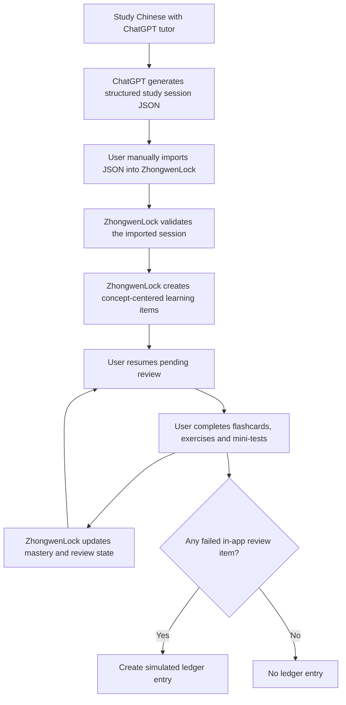
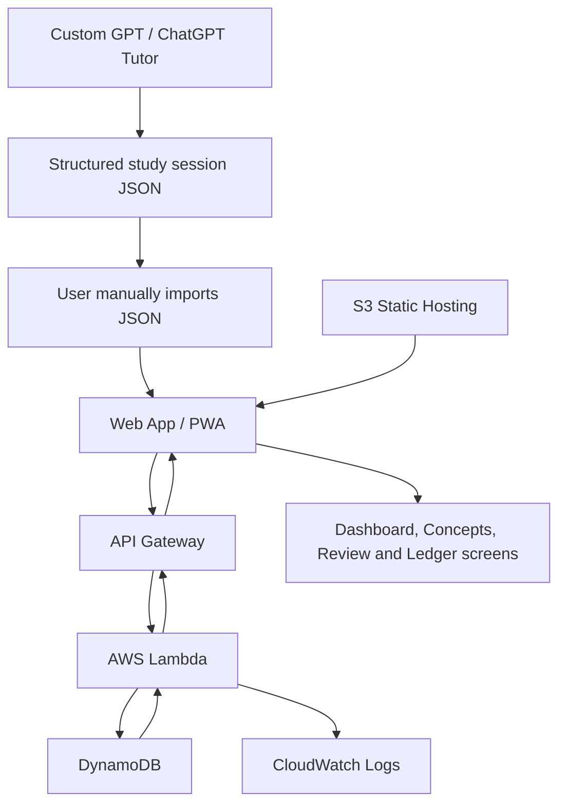
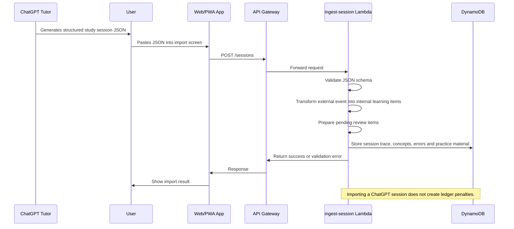
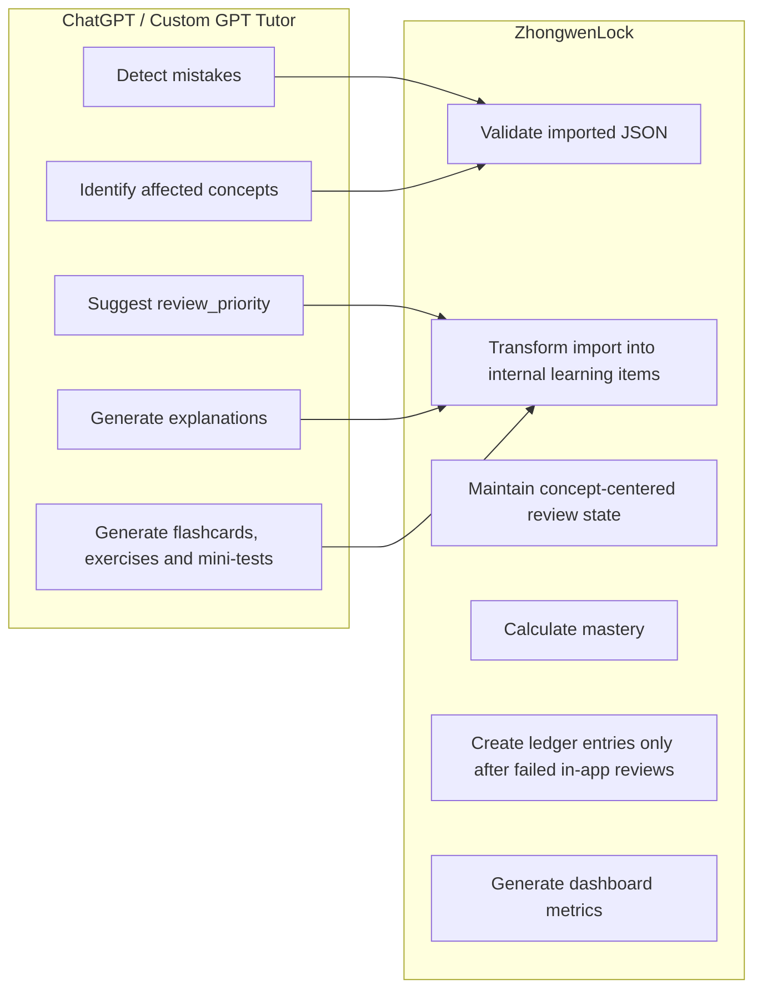
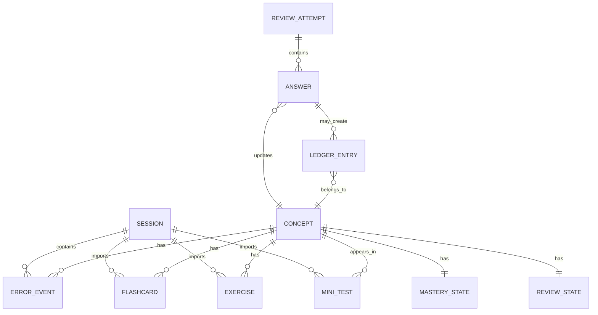
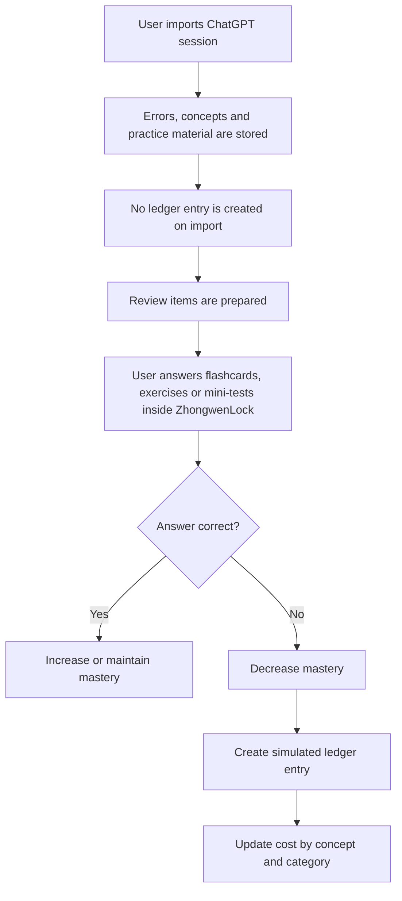

# Diagrams - ZhongwenLock

## Purpose

This document contains the first visual diagrams for ZhongwenLock.

The diagrams are intentionally simple. They are used to explain the product flow, responsibility boundaries and architecture decisions before the full implementation exists.

Each diagram also identifies which professional role would usually own or lead that type of work:

- Product Owner: focuses on user value, MVP scope, business rules and product behavior.
- Solutions Architect: focuses on system responsibilities, data flow, domain model and integration design.
- Cloud Architect: focuses on AWS services, deployment model, scalability, observability and infrastructure decisions.

---

## 1. Product Learning Loop

**Primary owner:** Product Owner  
**Supporting role:** Solutions Architect

**Why this diagram exists**

This diagram explains the product value loop from the user's point of view. It shows how a study session with ChatGPT becomes review material inside ZhongwenLock.

The Product Owner owns this diagram because it describes:

- the user journey;
- the MVP learning flow;
- the product value proposition;
- the moment when the user receives value.

The Solutions Architect supports it because the loop also implies system responsibilities and state transitions.

---

## 2. High-Level Architecture

**Primary owner:** Solutions Architect  
**Supporting role:** Cloud Architect

**Why this diagram exists**

This diagram shows the main technical building blocks of the solution and how they communicate.

The Solutions Architect owns this diagram because it defines:

- the main application components;
- the relationship between the frontend, API and backend;
- the integration between ChatGPT-generated JSON and ZhongwenLock;
- the general system structure.

The Cloud Architect supports it because the diagram includes AWS services such as API Gateway, Lambda, DynamoDB, S3 and CloudWatch.

---

## 3. Study Session Import Flow

**Primary owner:** Solutions Architect  
**Supporting roles:** Product Owner, Cloud Architect

**Why this diagram exists**

This diagram explains what happens when the user imports a ChatGPT-generated study session into ZhongwenLock.

The Solutions Architect owns this diagram because it describes:

- the end-to-end interaction flow;
- API boundaries;
- backend responsibilities;
- transformation from external JSON into internal learning items;
- where data persistence happens.

The Product Owner supports it because the flow reflects an MVP decision: JSON import is manual.

The Cloud Architect supports it because API Gateway, Lambda and DynamoDB are AWS implementation choices.

---

## 4. Responsibility Split

**Primary owner:** Solutions Architect  
**Supporting role:** Product Owner

**Why this diagram exists**

This diagram defines what ChatGPT is allowed to do and what ZhongwenLock must own internally.

The Solutions Architect owns this diagram because it defines:

- responsibility boundaries;
- separation of concerns;
- what belongs to the external AI tutor;
- what belongs to the ZhongwenLock application state.

The Product Owner supports it because these boundaries are also product decisions. In particular, ChatGPT must not calculate mastery, progress, dashboard metrics or ledger values.

---

## 5. Concept-Centered Model

**Primary owner:** Solutions Architect  
**Supporting role:** Product Owner

**Why this diagram exists**

This diagram explains the logical learning model of ZhongwenLock.

The Solutions Architect owns this diagram because it defines:

- the core domain entities;
- the relationship between sessions, concepts, errors and review attempts;
- how learning material connects to concepts;
- how ledger entries are linked to failed answers.

The Product Owner supports it because the decision to make the product concept-centered is a product decision, not only a technical one.

The important idea is that sessions are used for traceability, but the product revolves around concepts, mastery, review state and ledger behavior.

---

## 6. Ledger Flow

**Primary owner:** Product Owner  
**Supporting role:** Solutions Architect

**Why this diagram exists**

This diagram explains when the simulated ledger is updated.

The Product Owner owns this diagram because it defines an important product rule:

- importing mistakes from ChatGPT does not punish the user;
- the ledger is updated only when the user fails review items inside ZhongwenLock.

The Solutions Architect supports it because this rule must be reflected in the backend flow, data model and event handling.

---

## Diagram Ownership Summary

| Diagram | Primary owner | Supporting role | Main purpose |
|---|---|---|---|
| Product Learning Loop | Product Owner | Solutions Architect | Explain user value and MVP learning loop |
| High-Level Architecture | Solutions Architect | Cloud Architect | Explain the main technical components |
| Study Session Import Flow | Solutions Architect | Product Owner / Cloud Architect | Explain import, validation, transformation and persistence |
| Responsibility Split | Solutions Architect | Product Owner | Define what ChatGPT owns and what ZhongwenLock owns |
| Concept-Centered Model | Solutions Architect | Product Owner | Define the core learning domain model |
| Ledger Flow | Product Owner | Solutions Architect | Define when ledger entries are created |

---

## Notes

These diagrams describe the current intended MVP design.

Key design decisions:

- ChatGPT acts as a tutor and content generator.
- ChatGPT does not calculate mastery, progress, dashboard values or ledger values.
- ZhongwenLock owns mastery, review state, dashboard metrics and simulated ledger logic.
- Importing a ChatGPT session does not create ledger penalties.
- Ledger entries are created only when the user fails review items inside ZhongwenLock.
- The product model is concept-centered. Sessions are used for traceability.