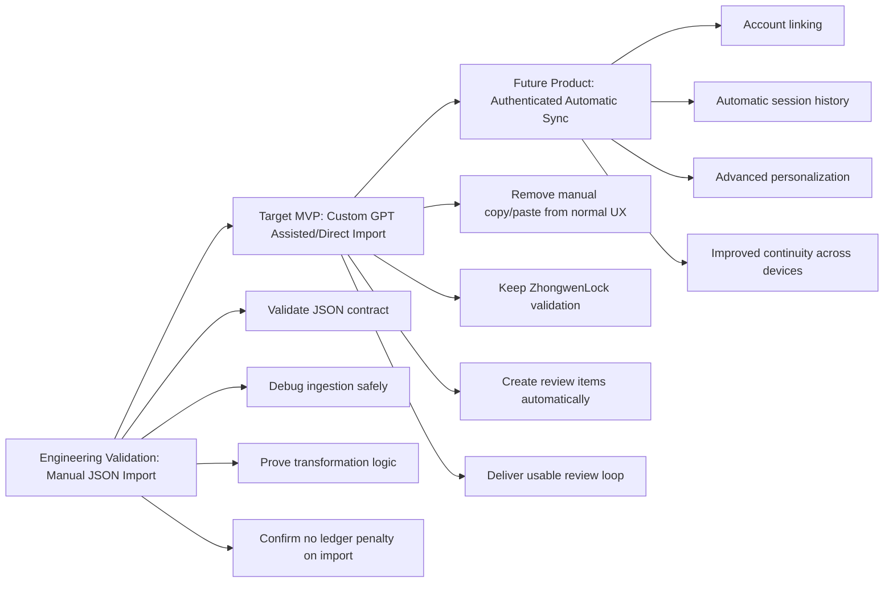
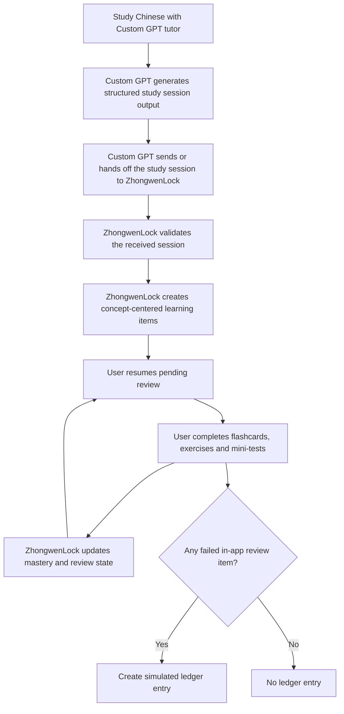
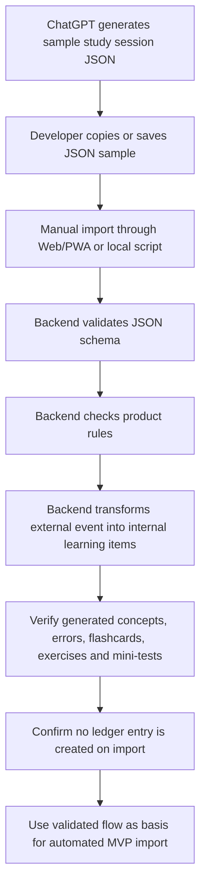
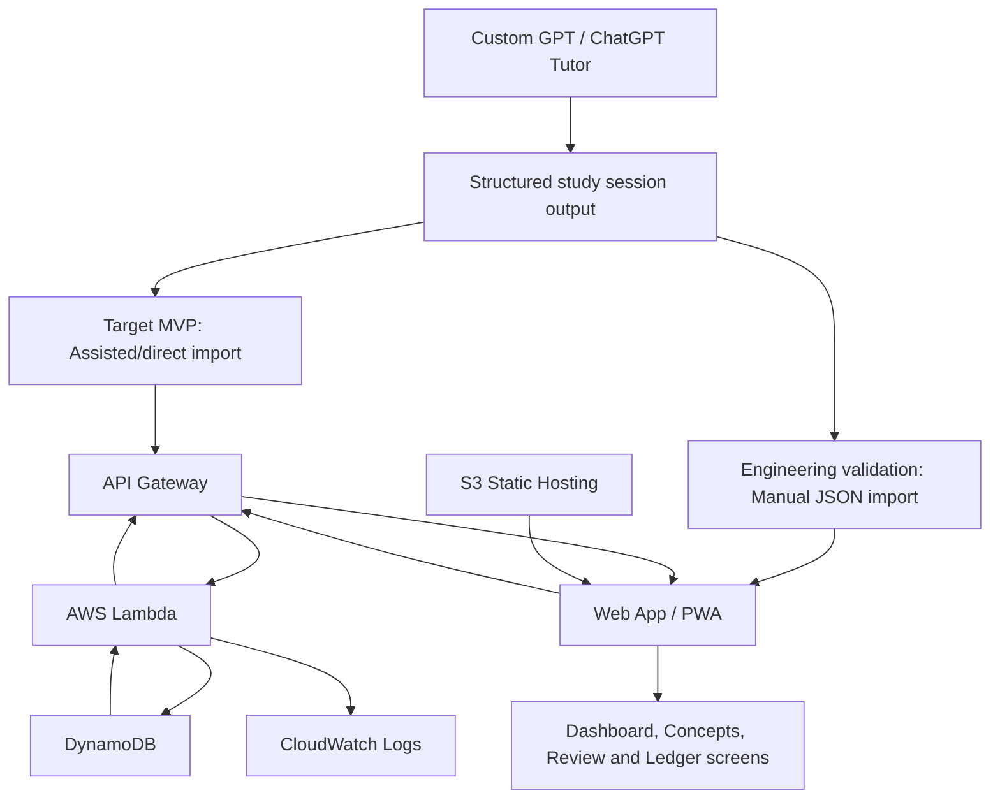
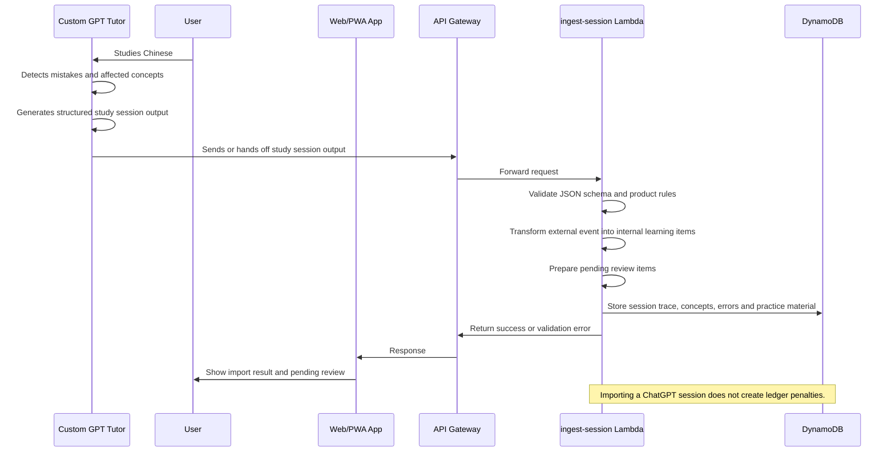
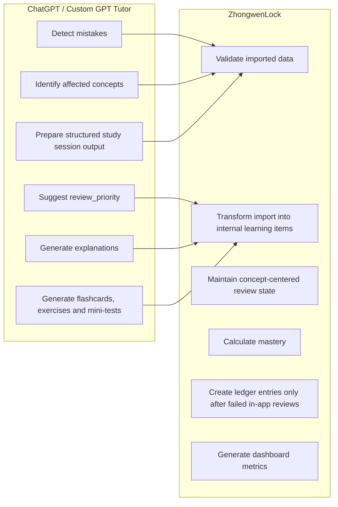
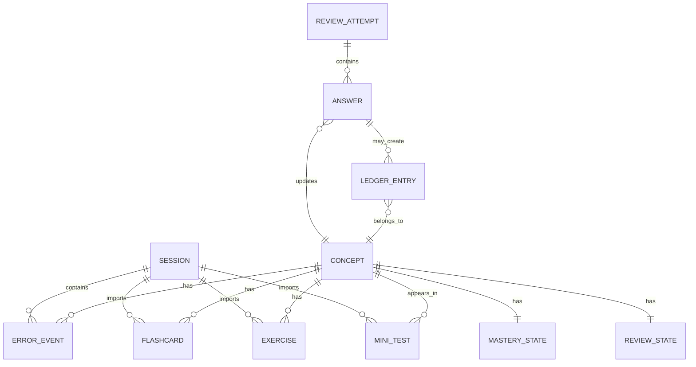
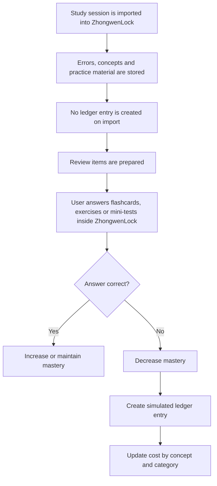

# Diagrams - ZhongwenLock

## Purpose

This document contains the first visual diagrams for ZhongwenLock.

The diagrams are intentionally simple. They are used to explain the product flow, responsibility boundaries, delivery evolution and architecture decisions before the full implementation exists.

ZhongwenLock separates the target MVP product experience from the engineering validation steps used to build it safely.

Manual JSON import is not the intended MVP user experience. It is an engineering validation step used before automating the Custom GPT import flow.

---

## Diagram Ownership

Each diagram identifies which professional role would usually own or lead that type of work:

- Product Owner: focuses on user value, MVP scope, business rules and product behavior.
- Solutions Architect: focuses on system responsibilities, data flow, domain model and integration design.
- Cloud Architect: focuses on AWS services, deployment model, scalability, observability and infrastructure decisions.

---

## Delivery Horizons

ZhongwenLock is represented across three delivery horizons:

| Horizon | Purpose | Import model | Main concern |
|---|---|---|---|
| Engineering Validation | Validate the JSON contract and ingestion pipeline with minimum risk | Manual JSON paste/upload or local sample | Debuggability and contract validation |
| Target MVP | Deliver the first usable learning loop | Custom GPT assisted/direct import with ZhongwenLock validation | User experience and product value |
| Future Product | Reduce manual steps and improve continuity | Authenticated automatic sync | Automation, security and scalability |

The manual import flow demonstrates the implementation path used to reduce risk before the target MVP automation.

---

## 1. Delivery Evolution

**Primary owner:** Product Owner  
**Supporting roles:** Solutions Architect, Cloud Architect  
**Horizon:** Engineering Validation to Future Product

This diagram explains how ZhongwenLock evolves from a low-risk validation step to the target MVP and then to a more automated future product.

**Key decision**

Manual JSON import is part of the engineering path, not the target MVP product experience.

---

## 2. MVP Product Learning Loop

**Primary owner:** Product Owner  
**Supporting role:** Solutions Architect  
**Horizon:** Target MVP

This diagram represents the intended MVP learning loop.

In the MVP, the user studies Chinese with a Custom GPT tutor. The Custom GPT generates structured study session output and sends or hands off that output to ZhongwenLock through an assisted or direct import flow.

**Design decision**

The target MVP should not require the user to manually paste JSON as the normal product experience.

Manual import is used earlier as an engineering validation step.

---

## 3. Engineering Validation Flow - Manual Import

**Primary owner:** Solutions Architect  
**Supporting role:** Cloud Architect  
**Horizon:** Engineering Validation

This diagram shows the manual import flow used during development to validate the JSON contract, backend ingestion logic and data transformation before automating the Custom GPT integration.

**Why this exists**

Manual import is not the final user experience. It is a deliberate implementation step used to reduce risk before connecting the Custom GPT directly to ZhongwenLock.

It helps validate:

- the study session JSON contract;
- backend validation rules;
- transformation into internal learning items;
- concept-centered data design;
- the rule that importing ChatGPT errors does not create ledger penalties.

---

## 4. High-Level Architecture

**Primary owner:** Solutions Architect  
**Supporting role:** Cloud Architect  
**Horizon:** Target MVP

This diagram shows the main technical building blocks of the target MVP.

The same ingestion backend should be reusable across the manual engineering validation path and the Custom GPT assisted/direct import path.

**Design decision**

Both import paths go through ZhongwenLock validation and transformation logic.

ChatGPT never becomes the source of truth for mastery, progress, review state, dashboard metrics or ledger values.

---

## 5. Study Session Import Flow

**Primary owner:** Solutions Architect  
**Supporting roles:** Product Owner, Cloud Architect  
**Horizon:** Target MVP

This diagram explains the target MVP import flow when the Custom GPT sends or hands off a structured study session to ZhongwenLock.

**Design decision**

The import mechanism can evolve, but ZhongwenLock must always validate the received data before creating internal learning items.

---

## 6. Responsibility Split

**Primary owner:** Solutions Architect  
**Supporting role:** Product Owner  
**Horizon:** All phases

This diagram defines what ChatGPT is allowed to do and what ZhongwenLock must own internally.

**Design decision**

The import mechanism may evolve from manual validation to assisted or automatic import, but the responsibility split does not change.

ZhongwenLock remains the system of record.

---

## 7. Concept-Centered Model

**Primary owner:** Solutions Architect  
**Supporting role:** Product Owner  
**Horizon:** All phases

This diagram explains the logical learning model of ZhongwenLock.

The important idea is that sessions are used for traceability, but the product revolves around concepts, mastery, review state and ledger behavior.

**Design decision**

The product model is concept-centered, not session-centered.

Sessions provide traceability. Concepts drive review, mastery and ledger behavior.

---

## 8. Ledger Flow

**Primary owner:** Product Owner  
**Supporting role:** Solutions Architect  
**Horizon:** All phases

This diagram explains when the simulated ledger is updated.

**Design decision**

Importing mistakes from ChatGPT does not punish the user.

The simulated ledger is updated only when the user fails review items inside ZhongwenLock.

---

## Diagram Ownership Summary

| Diagram | Primary owner | Supporting role | Main purpose |
|---|---|---|---|
| Delivery Evolution | Product Owner | Solutions Architect / Cloud Architect | Explain how the project moves from validation to MVP and future product |
| MVP Product Learning Loop | Product Owner | Solutions Architect | Explain the intended MVP user value loop |
| Engineering Validation Flow | Solutions Architect | Cloud Architect | Explain why manual import is used before automation |
| High-Level Architecture | Solutions Architect | Cloud Architect | Explain the main technical components |
| Study Session Import Flow | Solutions Architect | Product Owner / Cloud Architect | Explain import, validation, transformation and persistence |
| Responsibility Split | Solutions Architect | Product Owner | Define what ChatGPT owns and what ZhongwenLock owns |
| Concept-Centered Model | Solutions Architect | Product Owner | Define the core learning domain model |
| Ledger Flow | Product Owner | Solutions Architect | Define when ledger entries are created |

---

## Notes

These diagrams describe the current intended MVP design and the engineering path used to reach it.

Key design decisions:

- ChatGPT acts as a tutor and content generator.
- ChatGPT generates structured study session output.
- The target MVP uses a Custom GPT assisted/direct import flow.
- Manual JSON import is an engineering validation step, not the target MVP user experience.
- ChatGPT does not calculate mastery, progress, dashboard values or ledger values.
- ZhongwenLock owns validation, mastery, review state, dashboard metrics and simulated ledger logic.
- Importing a ChatGPT session does not create ledger penalties.
- Ledger entries are created only when the user fails review items inside ZhongwenLock.
- The product model is concept-centered. Sessions are used for traceability.